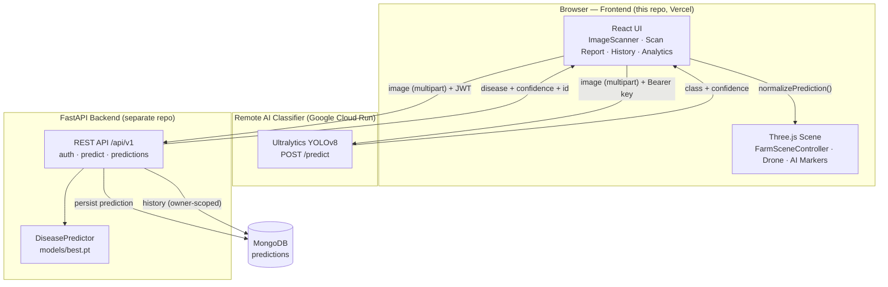

# AgriScan 3D

**AgriScan 3D: WebGPU-Based Drone Crop Mapping with AI-Powered Disease Detection**

A full-stack Final Year Project that combines an interactive 3D farm visualization, a virtual drone survey workflow, and YOLOv8-powered crop disease detection into a single web application — so that a farmer or agronomist can upload a crop image, get an AI disease verdict in seconds, and see the result mapped onto the 3D field alongside the drone that "captured" it.

This repository is the **frontend**. The complete system is:

**React Frontend → FastAPI Backend → YOLOv8 AI Detection → MongoDB Persistence**


---

## 🌐 Live Demo

**[▶ Open AgriScan 3D — https://agriscan-3d.vercel.app](https://agriscan-3d.vercel.app/)**

The live deployment runs the complete anonymous scan flow: 3D farm, virtual drone, and real YOLOv8 classification.

---

## 📖 Overview

Crop diseases are one of the largest recurring threats to agricultural yield, and smallholders typically notice an infection only after it has already spread. AgriScan 3D approaches this problem the way a modern precision-agriculture drone survey would:

1. A **virtual drone** patrols a 3D farm rendered in the browser, modelling the flight and capture phase of a real crop survey.
2. The user uploads (or selects) a **crop image** — the photo a survey drone would capture.
3. A **YOLOv8 classification model** analyses the image and returns the detected disease, the crop, and a confidence score.
4. The result is displayed in a **scan report**, linked to the user's **prediction history**, and projected into the **3D farm** as a disease marker at the location the drone's camera was covering.
5. For signed-in users, every authenticated scan is **persisted to MongoDB** via the FastAPI backend, powering user-private prediction history and field analytics.

The **frontend** (this repository) owns the entire user experience: the 3D/WebGL farm scene, the virtual drone, the image scanner, the scan report, authentication UI, prediction history, and field analytics. The **backend** (separate repository) owns the FastAPI REST API, JWT authentication, YOLOv8 inference, and MongoDB persistence.

---

## ✨ Key Features

### 3D Farm & Virtual Drone
- Interactive 3D farm environment rendered with **Three.js** — ground plane, crop field, lighting, and an orbiting cinematic camera.
- **Virtual drone** with animated rotors and a downward spotlight, flying a continuous **Lissajous patrol path** over the field.
- **Pause / resume** and **speed control** for the drone patrol, driven from the UI without rebuilding the scene.
- **HUD overlay** showing live mission telemetry derived from real scene state: scanning status, live altitude, and loop progress.
- **WebGPU capability badge** — the app detects WebGPU availability and reports it honestly (`WEBGPU ON` / `WEBGL MODE`); rendering currently uses WebGL (see [Current Limitations](#-current-limitations)).
- Fully responsive canvas with debounced resize handling and complete GPU resource disposal on unmount.

### AI Disease Detection
- **Image upload → AI prediction** workflow with an in-browser scanning animation.
- Real **YOLOv8** inference through the deployed classifier service (anonymous scans) **or** the FastAPI backend (authenticated, persisted scans).
- Per-detection **class label and confidence**, with a derived severity tier (healthy / low / medium / high).
- **HEALTHY vs DISEASED** status derived from the actual prediction data — failed scans never fabricate a result.
- Scan report shows detection count, average confidence, and inference time when available.

### AI ↔ 3D Integration
- Every AI detection becomes a **3D disease marker** in the farm scene.
- Markers are placed by **un-projecting the detection through the drone's nadir (downward-looking) pinhole camera** at the moment of capture — deterministic and consistent with the flight path — with a deterministic survey-grid fallback.
- **Marker lifecycle**: each new scan cleanly replaces the previous AI markers; failed/empty scans clear them and fall back to the demo disease zones. Old geometry and materials are disposed on every rebuild.
- **Click-to-inspect**: selecting a detection in the scan report highlights its 3D marker, and clicking a marker in the scene opens an info panel with the real label, confidence, and mapped position (explicitly labelled as a virtual, non-GPS projection).
- Four **demo disease zones** ship as the fallback visualization when no AI result is present.

### Authentication & Persistence
- **Register / login / logout** via the FastAPI JWT endpoints, with session restore per browser tab (token held in `sessionStorage`, never hardcoded or committed).
- **Prediction History**: paginated, newest-first list of the signed-in user's saved scans with HEALTHY/DISEASED status and expandable details.
- **Field Analytics**: totals, healthy/diseased counts, class distribution, and latest-scan info — computed only from the user's own persisted predictions and the current session. No polling, no fake numbers.
- **User isolation is enforced server-side**: history and analytics are scoped to the verified JWT identity; anonymous scanning remains available and does not write to any user's data.

---

## 🏗️ System Architecture



**Layer responsibilities**

| Layer | Responsibility |
| --- | --- |
| React UI | Uploads the image, renders the scan report, history, analytics, and auth controls. |
| Three.js scene | Owns the 3D farm, virtual drone, and AI markers; receives normalized detections through `FarmSceneController.setAiMarkers()`. |
| Remote classifier | Stateless YOLOv8 classification for anonymous scans (`POST /predict`). |
| FastAPI backend | JWT auth, authenticated/persisted inference (`/api/v1/predict`), owner-scoped history (`/api/v1/predictions`), and analytics data. |
| MongoDB | Stores every persisted prediction with its user attribution, class result, confidence, and timestamps. |

---

## 🔄 How AgriScan 3D Works

1. **The user opens the app** — the 3D farm loads with the virtual drone patrolling and the four demo disease zones visible as the fallback visualization.
2. **The user starts a scan** from the Image Scanner section and provides a crop image.
3. **The frontend sends the image** as `multipart/form-data`:
   - **Signed in** → `POST {VITE_API_BASE_URL}/api/v1/predict` with the JWT. The backend runs inference, **persists the prediction to MongoDB** under the authenticated user, and returns the result.
   - **Anonymous** (or if the backend is unreachable) → `POST {VITE_API_URL}/predict` directly to the deployed YOLOv8 classifier.
4. **The AI result returns** — disease/class label, confidence, inference time, and (for persisted scans) the prediction ID and database status.
5. **The frontend normalizes the response** (`normalizePrediction()`) into a uniform detection list, whatever the source.
6. **React state updates**: the scan report renders the real detections, prediction history and field analytics refresh on their next load, and the normalized detections flow into `FarmViewer3D` as props.
7. **The 3D scene updates**: `FarmSceneController.setAiMarkers()` replaces the previous AI markers with markers for the new detections, projected through the drone's capture-time camera.
8. **Interaction**: the user can click a report row or a 3D marker to cross-highlight, inspect label/confidence/position, and (when signed in) revisit the scan later from Prediction History.

---

## 🧠 AI Model

| Property | Value |
| --- | --- |
| Model | **YOLOv8n-cls** (Ultralytics classification model, fine-tuned) |
| Framework | Ultralytics `8.3.56` on PyTorch (CPU inference in the backend container) |
| Weights | `models/best.pt` in the backend repository (~2.9 MB) |
| Task | **Single-image classification** — top-1 class + probability |
| Classes | **38 crop/disease classes** from the PlantVillage label space (e.g. `Tomato___Early_blight`, `Corn_(maize)___healthy`) |
| Training | `train_model.py` in the backend repo; dataset scripts pull the PlantVillage dataset |
| Output fields | `disease`, `crop`, `confidence` (0–100), `is_healthy`, `class_name`, `class_index` |
| Thresholds | Classifier request defaults: `conf=0.25`, `iou=0.7`, `imgsz=640` |

**How the frontend interprets results**

- `is_healthy` (or a label matching `healthy`) renders as **HEALTHY**; anything else as **DISEASED**.
- A severity tier is derived from the model's own confidence: `≥ 0.60 → high`, `≥ 0.35 → medium`, otherwise `low` (healthy results are excluded).
- No severity, accuracy, or geolocation value is invented anywhere in the pipeline — only what the model actually returns.

**Honest scope note:** the deployed model is a *classifier*. It returns class probabilities, **not bounding boxes**. The 3D markers therefore represent *where the virtual drone was looking* (documented virtual projection), not pixel-verified lesion locations. See [Current Limitations](#-current-limitations).

---

## 🌾 3D Farm & Drone Visualization

All 3D code lives in `src/three/` as framework-agnostic modules; React only mounts/unmounts the controller and mirrors UI state into it.

| Module | Responsibility |
| --- | --- |
| `FarmSceneController.js` | Owns the renderer, camera, scene graph, and the single animation loop. Exposes `setScanning()`, `setDroneSpeed()`, `setAiMarkers()`, `highlightAiMarker()`, marker picking, mission state, and full `dispose()`. |
| `scene.js` | Builds the scene, lighting, ground plane, instanced crop field, and the demo disease zones. |
| `drone.js` | Builds the virtual drone model (body, arms, rotors) with rotor spin states for active/idle. |
| `dronePath.js` | Lissajous patrol path; includes an allocation-free per-frame variant used by the render loop. |
| `droneCamera.js` | Virtual **nadir pinhole camera** model — un-projects a normalized image point onto the ground plane at the drone's capture position. Documented as a virtual camera model, **not GPS**. |
| `aiMarkers.js` | Maps detections to 3D positions (camera projection, with deterministic survey-grid fallback), builds/disposes marker meshes, appear/pulse animations, and selection highlighting. |
| `config.js` | Single source of truth for field size, demo disease zones, severity colours, and drone constants — shared by the scene and the HUD. |

`FarmViewer3D.jsx` connects it all: it creates the controller once, feeds it AI detections and selection state as props, renders the HUD (WebGPU badge, scanning status, altitude, disease count), and disposes everything on unmount. React re-renders never rebuild the Three.js scene.

---

## 🛠️ Technology Stack

| Layer | Technology |
| --- | --- |
| Frontend | React 18, Vite 5 |
| 3D | Three.js 0.160 |
| Styling | Tailwind CSS 3 + custom CSS design tokens |
| Language | JavaScript (ES modules) |
| AI serving | Ultralytics YOLOv8 (Cloud Run classifier) + FastAPI inference |
| Backend | FastAPI, Uvicorn (Python 3.11) |
| Database | MongoDB (Motor / pymongo, Atlas-ready) |
| Auth | JWT (python-jose) + bcrypt password hashing |
| Testing | pytest (backend) |
| Containerization | Docker (backend, CPU-only PyTorch) |
| Deployment | Vercel (frontend) · Docker/Cloud-Run-ready (backend) |

---

## 📁 Project Structure

### Frontend (this repository)

```text
Agriscan-3D-frontend/
├── index.html
├── package.json
├── vite.config.js
├── tailwind.config.js
├── postcss.config.js
├── .env.example              # environment template (placeholders only)
└── src/
    ├── App.jsx               # page composition + scan state + selection state
    ├── main.jsx
    ├── index.css
    ├── components/
    │   ├── Navbar.jsx            # navigation
    │   ├── FarmViewer3D.jsx      # 3D scene host + HUD overlay
    │   ├── StatsCards.jsx        # field intelligence dashboard
    │   ├── ScanDashboard.jsx     # live scan dashboard
    │   ├── ImageScanner.jsx      # upload → inference → scan report
    │   ├── PredictionHistory.jsx # paginated saved scans (auth)
    │   ├── FieldAnalytics.jsx    # real-data analytics (auth + session)
    │   ├── FieldHealthMap.jsx    # field health overview
    │   ├── AuthPanel.jsx         # login / register / logout controls
    │   └── TeamSection.jsx       # project team
    ├── context/
    │   └── AuthContext.jsx       # JWT session state (login/logout/restore)
    ├── services/
    │   └── api.js                # API client + response normalization
    └── three/
        ├── FarmSceneController.js
        ├── scene.js
        ├── drone.js
        ├── dronePath.js
        ├── droneCamera.js
        ├── aiMarkers.js
        └── config.js
```

### Backend ([Rabiabbasi66/agriscan-backend](https://github.com/Rabiabbasi66/agriscan-backend))

```text
agriscan-backend/
├── Dockerfile                # python:3.11-slim, CPU-only PyTorch, $PORT-aware CMD
├── requirements.txt          # pinned production dependencies
├── train_model.py            # YOLOv8 training script
├── download_dataset.py       # PlantVillage dataset download
├── models/best.pt            # trained model weights (~2.9 MB)
├── test_images/              # sample images for manual testing
├── tests/                    # pytest suite (auth, predictions, database config, …)
└── app/
    ├── main.py               # FastAPI app, router registry, middleware
    ├── config.py             # pydantic-settings configuration
    ├── database.py           # MongoDB client/lifecycle (env-configured)
    ├── dependencies.py       # JWT current-user dependencies
    ├── security.py           # password hashing / token handling
    ├── routers/              # auth, predict, predictions, farms, fields,
    │   ├── …                 # uploads, results, notifications, health
    ├── services/
    │   └── disease_predictor.py  # YOLOv8 inference (models/best.pt)
    ├── schemas/              # request/response models
    ├── models/               # MongoDB document helpers
    ├── workers/              # Celery tasks (optional batch pipeline)
    └── utils/                # helpers
```

---

## 🔌 Backend API

**Backend repository:** [Rabiabbasi66/agriscan-backend](https://github.com/Rabiabbasi66/agriscan-backend)

The frontend talks to **two services** (configured separately on purpose — auth/history must never be sent to the classifier):

### 1. Disease prediction

| | Signed-in (persisted) | Anonymous (classifier) |
| --- | --- | --- |
| Endpoint | `POST {VITE_API_BASE_URL}/api/v1/predict` | `POST {VITE_API_URL}/predict` |
| Auth | `Authorization: Bearer <JWT>` | `Authorization: Bearer <VITE_API_KEY>` |
| Body | `multipart/form-data`, field `file` | `multipart/form-data`: `file`, optional `conf`, `iou`, `imgsz` |
| Persisted to MongoDB | ✅ yes, attributed to the JWT user | ❌ no |

**FastAPI response contract:**

```json
{
  "success": true,
  "data": {
    "disease": "Early blight",
    "crop": "Tomato",
    "confidence": 83.17,
    "is_healthy": false,
    "class_name": "Tomato___Early_blight",
    "class_index": 29
  },
  "inference_time_ms": 3675.43,
  "saved_to_db": true,
  "prediction_id": "6aaec8a9f3e4b1a2c3d4e5f6"
}
```

`saved_to_db` is honest: if MongoDB persistence fails, the prediction is still returned with `saved_to_db: false` and `prediction_id: null`. The remote classifier returns a different, Ultralytics-native shape (`images[].results[]` + `metadata.task`), which `normalizePrediction()` converts to the same internal detection format — no frontend component knows or cares which service answered.

### 2. Prediction history (JWT required)

```
GET {VITE_API_BASE_URL}/api/v1/predictions?page=1&page_size=20
GET {VITE_API_BASE_URL}/api/v1/predictions/{id}
```

Paginated, newest first, and **owner-scoped server-side** — a user can only ever read their own predictions. Invalid ObjectIds return `422`; someone else's prediction ID returns `404`.

### 3. Authentication

```
POST {VITE_API_BASE_URL}/api/v1/auth/register
POST {VITE_API_BASE_URL}/api/v1/auth/login
GET  {VITE_API_BASE_URL}/api/v1/auth/me
```

Login returns a JWT access token (`TokenResponse`); the frontend attaches it as a Bearer token and stores it in `sessionStorage` for the tab session only. `401` responses (expired/invalid token) clear the local session and return the UI to signed-out state — anonymous scanning keeps working.

---

## 🚀 Getting Started (Frontend)

### Prerequisites

- **Node.js** 18+ and npm
- **Git**
- A modern browser (the 3D scene uses WebGL; the WebGPU badge reflects capability detection)

### Clone

```bash
git clone https://github.com/Rabiabbasi66/Agriscan-3D-frontend.git
cd Agriscan-3D-frontend
```

### Install

```bash
npm install
```

### Environment Variables

Copy the template and fill in what you need — every variable is optional; the app has built-in defaults:

```bash
cp .env.example .env.local
```

```dotenv
# .env.local — never commit this file
VITE_API_URL=https://your-yolov8-classifier.example.com
VITE_API_KEY=your-classifier-api-key
VITE_API_BASE_URL=http://localhost:8000
```

| Variable | Purpose | Default when unset |
| --- | --- | --- |
| `VITE_API_URL` | Remote YOLOv8 classifier base URL (anonymous scans) | Deployed Cloud Run classifier |
| `VITE_API_KEY` | Bearer key for the classifier above | empty |
| `VITE_API_BASE_URL` | FastAPI backend base URL (auth, history, persisted scans) | `http://localhost:8000` |

> Vite inlines `VITE_*` variables **at build time** — after changing them, restart the dev server or redeploy.

### Run

```bash
npm run dev        # development server (http://localhost:3000)
npm run build      # production build → dist/
npm run preview    # serve the production build locally
```

---

## 🖥️ Backend Setup

The FastAPI backend lives in its own repository:

```bash
git clone https://github.com/Rabiabbasi66/agriscan-backend.git
cd agriscan-backend
```

### Local (Python)

```bash
python -m venv venv
venv\Scripts\activate            # Windows  (source venv/bin/activate on Linux/macOS)
pip install -r requirements.txt
```

Create a `.env` in `backend/` (never commit it):

```dotenv
MONGODB_URI=mongodb+srv://<username>:<password>@<cluster>/<database>
MONGODB_DB_NAME=agriscan
JWT_SECRET_KEY=replace-with-a-long-random-secret
ALLOWED_ORIGINS=["http://localhost:3000"]
```

Start the API (the trained model must be at `models/best.pt`):

```bash
uvicorn app.main:app --host 0.0.0.0 --port 8000
```

### Docker

```bash
docker build -t agriscan-backend .
docker run -p 8080:8080 --env-file .env -e PORT=8080 agriscan-backend
```

The image is production-oriented: Python 3.11 slim base, **CPU-only PyTorch** (installed from the official CPU wheel index, avoiding the multi-GB CUDA stack), and a `CMD` that honours Cloud Run's `$PORT` with `8000` as the local fallback (`uvicorn app.main:app --host 0.0.0.0 --port ${PORT:-8000}`). All secrets are injected via environment variables — none are hardcoded or baked into the image.

The API then serves at `http://localhost:8000` (docs at `/docs`); set the frontend's `VITE_API_BASE_URL=http://localhost:8000` for local development.

---

## 🔐 Environment Variables & Security

- **Frontend (public, build-time):** `VITE_API_URL`, `VITE_API_KEY`, `VITE_API_BASE_URL`. Anything prefixed `VITE_` is embedded in the shipped JavaScript bundle — treat the classifier key accordingly and rely on the service's per-key restrictions.
- **Backend (private, runtime):** `MONGODB_URI`, `MONGODB_DB_NAME`, `JWT_SECRET_KEY`, `ALLOWED_ORIGINS`, and optional integration keys. These are supplied through environment variables / container secrets and are **never** hardcoded in source.
- `.env`, `.env.local`, and `backend/.env` are **gitignored**; only placeholder-only `.env.example` files are tracked.
- Passwords are bcrypt-hashed; JWTs are signed with a configuration-provided secret and expire; prediction ownership is derived from the **verified JWT subject**, never from a client-supplied user ID.
- Never commit real credentials, MongoDB URIs, or API keys to either repository.

---

## 🧪 Testing

**Backend** — pytest suite covering authentication, prediction persistence, owner-scoped history, and database configuration (mocked MongoDB; no live server required):

```bash
cd agriscan-backend
pytest -q
```

**Frontend** — validation is currently via the production build (`npm run build`) and manual verification of the scan → report → 3D marker flow.

---

## 📸 Screenshots / Demo

> Screenshots are not yet committed to this repository. Planned additions:
>
> - 3D farm with virtual drone and HUD
> - Image scanner with scan report (HEALTHY/DISEASED results)
> - AI disease markers mapped in the 3D field
> - Prediction history and field analytics (signed in)

Meanwhile, the live application is the best demo: **[https://agriscan-3d.vercel.app](https://agriscan-3d.vercel.app/)**

---

## 📦 Deployment

| Component | Platform | Status |
| --- | --- | --- |
| Frontend (this repo) | **Vercel** | ✅ Live — [https://agriscan-3d.vercel.app](https://agriscan-3d.vercel.app/) |
| YOLOv8 classifier | **Google Cloud Run** (containerized Ultralytics serving) | ✅ Live — configured via `VITE_API_URL` |
| FastAPI backend | Dockerized (CPU-only PyTorch, `$PORT`-aware `CMD` for Cloud Run) | Container build and runtime verified; public deployment pending |

The frontend is deployed by connecting this repository to Vercel (`npm run build`, output `dist/`, framework Vite). Set `VITE_API_URL`, `VITE_API_KEY`, and `VITE_API_BASE_URL` as Vercel environment variables, and **redeploy** after changing them (Vite inlines them at build time). The backend's CORS is configuration-driven (`ALLOWED_ORIGINS`), so the Vercel domain can be allowed without code changes.

---

## 🔗 Related Repositories

| | Link |
| --- | --- |
| **Frontend** (this repo) | <https://github.com/Rabiabbasi66/Agriscan-3D-frontend> |
| **Backend** (FastAPI + YOLOv8 + MongoDB) | <https://github.com/Rabiabbasi66/agriscan-backend> |
| **Live Application** | <https://agriscan-3d.vercel.app/> |

---

## 👨‍💻 Project Team

| Member | Role | Focus |
| --- | --- | --- |
| **Fazal-E-Rabbi Abbasi** | Lead Backend & AI Engineer | FastAPI REST APIs · JWT authentication · MongoDB database design · YOLOv8 training & deployment · AI inference pipeline · backend deployment |
| **Talal Yousaf** | Frontend Developer & AI Consumer | React UI · FastAPI/API integration · authentication · image upload · dashboards · responsive design |
| **Seemab Jadoon** | 3D Visualization Engineer | Three.js/WebGPU 3D farm · terrain & lighting · camera controls · animations · rendering performance |

---

## 🎓 Final Year Project

AgriScan 3D is developed as a **Final Year Project (FYP)** for the **Software Engineering** program at **Sarhad University of Science & Information Technology (SUIT)**. The project spans the full engineering lifecycle: AI model training, backend API design, database persistence, security, 3D client engineering, and cloud deployment.

---

## 🚧 Current Limitations

Stated openly, as project scope rather than failures:

- **Rendering is WebGL.** The app detects WebGPU capability and surfaces it as an informational HUD badge, but the Three.js scene currently renders through `WebGLRenderer`. WebGPU rendering is future work; the project title reflects the system's WebGPU-focused research direction.
- **The AI model is a classifier.** It returns class + confidence per image — no bounding boxes — so the 3D markers cannot represent pixel-verified lesion positions.
- **Marker positions are a documented virtual projection, not GPS.** Detections are mapped through a simulated nadir pinhole camera at the drone's capture position (with a deterministic survey-grid fallback). This is deterministic and consistent with the flight path, but it is **not** real geospatial ground truth — the UI labels it accordingly. Real GPS/telemetry integration would slot in behind the same `setAiMarkers()` API.
- **The drone is virtual.** It simulates the survey workflow in the browser; it does not control physical hardware.
- **Backend public deployment is pending.** The backend is Dockerized and verified, but signed-in features (history/analytics persistence) require the backend to be reachable from the deployed frontend; anonymous scanning works without it.
- **PlantVillage scope.** Detection covers the crop/disease classes the model was trained on (38 PlantVillage classes); out-of-domain imagery yields lower-confidence predictions.

---

## 🔮 Future Improvements

Planned work — **not** implemented yet:

- **Real geospatial mapping** — replace the virtual camera projection with actual drone GPS/telemetry + geotagged imagery, keeping the existing marker API.
- **Object-detection upgrade** — a YOLOv8 detection/segmentation model returning bounding boxes, enabling pixel-accurate lesion placement and per-lesion markers.
- **Model evaluation & expansion** — published accuracy benchmarks, more crops/disease classes, and field-collected training data.
- **Native WebGPU rendering path** via Three.js' WebGPURenderer as the renderer matures.
- **Production backend rollout** — managed container deployment with secrets, autoscaling, and monitoring.
- **Deeper analytics** — historical disease trends and field-level heatmaps built on the persisted prediction data.

---

## 📄 License

No license has been specified for this repository yet. All rights are reserved by the project team until a license is added.

---

## 🙏 Acknowledgements

- [Ultralytics YOLOv8](https://github.com/ultralytics/ultralytics) — model architecture, training, and serving
- [PlantVillage dataset](https://www.kaggle.com/datasets/emmarex/plantdisease) — crop disease image corpus used for training
- [Three.js](https://threejs.org/) — 3D rendering
- [React](https://react.dev/) and [Vite](https://vite.dev/) — application framework and tooling
- [FastAPI](https://fastapi.tiangolo.com/) — backend API framework
- [MongoDB](https://www.mongodb.com/) — prediction persistence
